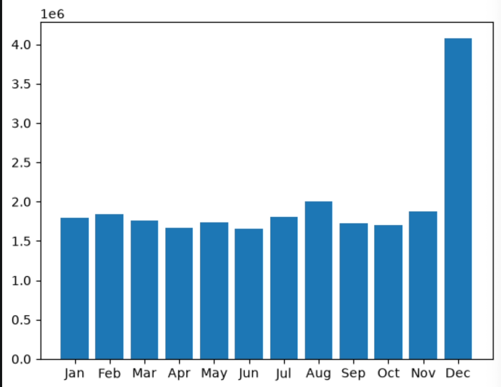
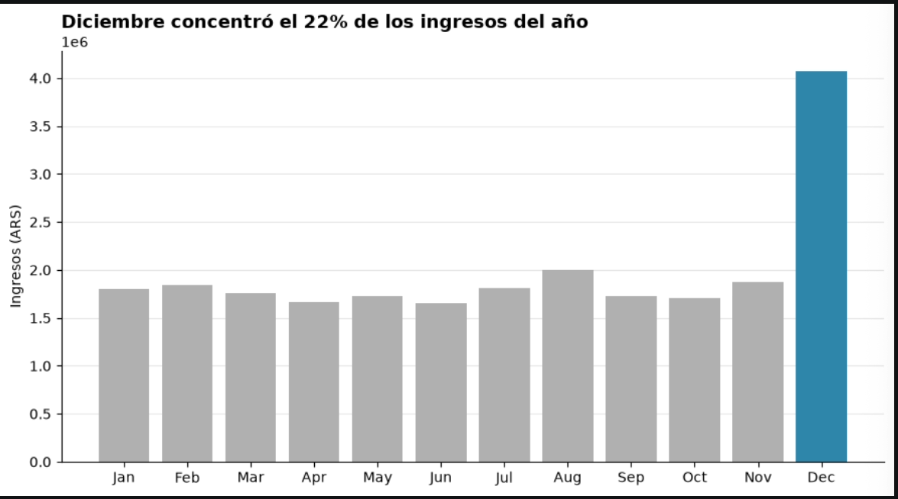
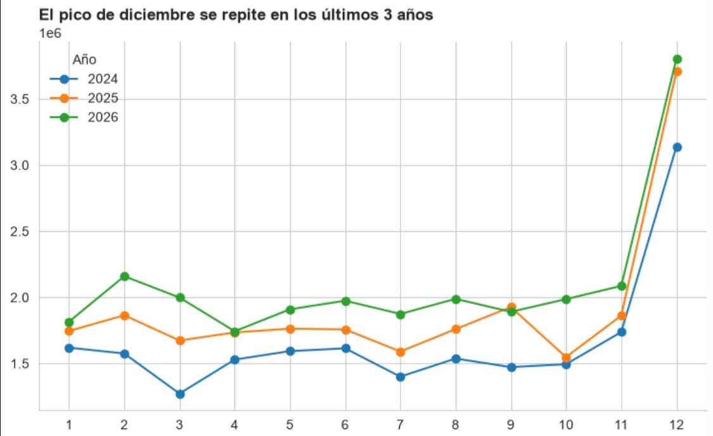

# Clase 17 — Personalización de gráficos, buenas prácticas de visualización y Data Storytelling

Imagina que preparas un gráfico de barras en pocos minutos y lo presentas en una reunión de trabajo. Los datos están bien calculados, pero alguien pregunta: "¿qué es lo que estoy viendo exactamente?". El gráfico tiene el título por defecto, los ejes sin unidades, colores que no representan nada en particular, y ningún elemento que indique dónde debería mirar la persona que lo observa.

Ese es el problema central de esta clase: calcular bien un dato no garantiza que otra persona lo entienda, y mucho menos que actúe en base a él. La distancia entre "el dato es correcto" y "la empresa tomó una decisión gracias a ese dato" se cubre con tres herramientas: cómo personalizamos un gráfico, qué buenas prácticas seguimos al elegirlo, y cómo lo presentamos dentro de una historia. Vamos a ver las tres, en ese orden.

## Antes de empezar: matplotlib y seaborn

En clases anteriores trabajaste con **matplotlib**, la librería de Python más usada para crear gráficos. Matplotlib te da control total sobre cada elemento del gráfico —cada línea, cada color, cada texto— pero justamente por eso, a veces requiere bastante código para lograr un resultado claro.

En esta clase vamos a incorporar **seaborn**, otra librería para crear gráficos que en realidad está construida *sobre* matplotlib. Es decir, seaborn no reemplaza a matplotlib: lo usa por debajo, pero te ofrece funciones más simples para los tipos de gráficos que se usan con más frecuencia en análisis de datos, y aplica automáticamente un estilo visual más cuidado (colores, proporciones, tipografía) sin que tengas que configurarlo a mano.

Una forma simple de pensarlo: si matplotlib es como tener una caja de herramientas completa donde armas cada gráfico pieza por pieza, seaborn es como tener moldes ya preparados para los gráficos estadísticos más comunes —comparar categorías, ver distribuciones, relacionar variables— que además vienen con un diseño más agradable por defecto.

Para usar seaborn, primero hay que instalarlo (si todavía no lo tienes) e importarlo junto con matplotlib, ya que en la práctica se usan combinados:

```python
import matplotlib.pyplot as plt
import seaborn as sns
```

`sns` es el alias que se usa por convención para seaborn, de la misma forma que `plt` es el alias habitual para matplotlib. Verás ambos en el resto del artículo, porque muchas veces se usa seaborn para generar el gráfico y matplotlib para ajustar detalles finales.

## Personalización de gráficos

El gráfico que aparece "por defecto" al usar cualquier librería está pensado para que tú, como analista, explores los datos rápidamente mientras trabajas. No está pensado para que otra persona, que nunca vio esos datos, entienda algo en pocos segundos. Personalizar un gráfico no significa "hacerlo más lindo": significa quitar todo lo que no ayuda a leer el mensaje, y reforzar lo que sí ayuda.

Piensa en esto: cada elemento visual que agregas —un color, una anotación, una línea de referencia— le está pidiendo atención a quien mira el gráfico. Si le pides atención para diez cosas a la vez, en realidad no se la diste a ninguna. Personalizar bien un gráfico es, sobre todo, decidir qué cosas **no** mostrar.

### Aplicándolo con matplotlib

Empecemos por el gráfico por defecto, el que conviene evitar en una presentación:

```python
import pandas as pd
import matplotlib.pyplot as plt

ventas = pd.read_csv("practica/ventas_mensuales.csv", parse_dates=["mes"])

fig, ax = plt.subplots()
ax.bar(ventas["mes"].dt.strftime("%b"), ventas["ingresos"])
plt.show()
```



Este código funciona y el gráfico se genera sin errores, pero no comunica ningún mensaje por sí solo. Ahora pensemos qué necesita un gráfico para que alguien, sin ningún contexto previo, entienda la idea principal de un vistazo: un título que sea una afirmación concreta (no una descripción genérica como "Ingresos por mes"), los ejes con sus unidades correspondientes, y algún elemento visual que dirija la mirada hacia lo más importante.

```python
fig, ax = plt.subplots(figsize=(9, 5))

# Creamos una lista de colores gris para todas las barras, y un color
# distinto solo para la barra que queremos resaltar.
colores = ["#B0B0B0"] * len(ventas)
mes_pico = ventas["ingresos"].idxmax()
colores[mes_pico] = "#2E86AB"

ax.bar(ventas["mes"].dt.strftime("%b"), ventas["ingresos"], color=colores)

ax.set_title("Diciembre concentró el 22% de los ingresos del año", loc="left", fontsize=13, weight="bold")
ax.set_ylabel("Ingresos (ARS)")
ax.spines[["top", "right"]].set_visible(False)  # quitamos los bordes que no aportan información
ax.yaxis.grid(True, alpha=0.3)
ax.set_axisbelow(True)

plt.tight_layout()
plt.show()
```



Observa el cambio principal: el título ya no describe el gráfico, sino que comunica la conclusión que quieres que la persona se lleve. Eso es personalizar con intención, no decorar. El color resalta un solo mes en lugar de usar una paleta de colores distintos que no representan ninguna categoría real. Y quitamos los bordes superior y derecho del gráfico, porque esas líneas no aportan ninguna información, solo ruido visual.

### El mismo resultado con seaborn

Ahora veamos cómo se resuelve algo parecido usando seaborn. La función `sns.barplot()` construye el gráfico de barras a partir de un DataFrame directamente, sin que tengas que calcular las posiciones de cada barra a mano:

```python
import seaborn as sns

sns.set_style("whitegrid")  # aplica un estilo general prolijo a todos los gráficos siguientes

fig, ax = plt.subplots(figsize=(9, 5))

sns.barplot(
    data=ventas,
    x=ventas["mes"].dt.strftime("%b"),
    y="ingresos",
    color="#B0B0B0",
    ax=ax,
)
ax.patches[mes_pico].set_facecolor("#2E86AB")  # resaltamos la barra del mes pico
ax.set_title("Diciembre concentró el 22% de los ingresos del año", loc="left", weight="bold")
```

Observa que seguimos usando `ax` y varias funciones de matplotlib (`set_title`, `ax.patches`) para ajustar detalles, aunque el gráfico en sí lo generó seaborn con `sns.barplot()`. Esa combinación es completamente normal: en la práctica, seaborn se usa para crear el gráfico de base de forma rápida, y matplotlib para pulir los detalles finales.

En resumen, la personalización útil casi siempre se reduce a cuatro decisiones, sea que uses matplotlib o seaborn: qué destacas con color, qué texto reemplazas por una conclusión en lugar de una descripción, qué elementos quitas, y qué escala usas en los ejes. Un eje Y que no comienza en cero, por ejemplo, puede exagerar una diferencia que en la realidad es pequeña, y eso ya no es personalización: es inducir a un error de lectura.

## Buenas prácticas de visualización

Aquí la pregunta no es "cómo lo hago más atractivo" sino "qué tipo de gráfico es honesto y fácil de leer para este dato en particular". Existe una tentación fuerte, sobre todo al empezar, de usar el gráfico más llamativo disponible. Esa tentación casi siempre juega en contra de la claridad.

Algunas reglas que se cumplen en la gran mayoría de los casos:

**Elige el tipo de gráfico según la pregunta, no según lo que se ve mejor.** Si quieres comparar categorías, usa barras. Si quieres mostrar una evolución en el tiempo, usa líneas. Si quieres mostrar la relación entre dos variables numéricas, usa un gráfico de dispersión. Un gráfico de torta para comparar seis categorías es casi siempre peor que una barra horizontal ordenada, porque el ojo humano compara longitudes con mucha más facilidad que ángulos.

**Ordena los datos, no dejes el orden por defecto.** Una lista de categorías ordenada alfabéticamente casi nunca responde a la pregunta que alguien realmente tiene. Ordenar de mayor a menor permite que la comparación sea inmediata, en lugar de obligar a quien mira el gráfico a hacer el ranking mentalmente.

**Evita los efectos en 3D y los adornos decorativos en gráficos de negocio.** Un gráfico de barras en 3D distorsiona la percepción de la altura por efecto de la perspectiva, y no agrega ninguna información que no tuviera la versión plana del mismo gráfico.

**Cuida el uso del color más allá de la estética.** Usa una paleta secuencial (tonos de un mismo color, de claro a oscuro) cuando los datos van de menor a mayor. Usa una paleta divergente (dos colores que se alejan de un punto medio) cuando los datos tienen un punto de referencia claro, como una variación porcentual por encima o por debajo de cero. Y ten en cuenta a las personas con daltonismo: usar rojo y verde como única forma de distinguir "bien" de "mal" deja afuera a una parte real de tu audiencia.

### Aplicándolo con matplotlib y seaborn

Veamos el caso típico de "gráfico circular contra barra horizontal ordenada" usando el mismo dato. Con matplotlib:

```python
categorias = pd.read_csv("practica/ventas_por_categoria.csv")
categorias = categorias.sort_values("ingresos", ascending=True)

fig, ax = plt.subplots(figsize=(8, 5))
ax.barh(categorias["categoria"], categorias["ingresos"], color="#2E86AB")
ax.set_title("Electrónica lidera con más del doble que la segunda categoría", loc="left", weight="bold")
ax.set_xlabel("Ingresos (ARS)")
```

Con seis categorías, esa barra horizontal ordenada se lee en pocos segundos. La misma información en un gráfico circular obliga a comparar ángulos entre sectores parecidos, y eso —salvo que exista una sola categoría claramente dominante— exige mucho más esfuerzo del que parece a primera vista.

Seaborn incluye una función pensada específicamente para comparar distribuciones y categorías con menos código. Por ejemplo, para el mismo gráfico de barras horizontal:

```python
fig, ax = plt.subplots(figsize=(8, 5))
sns.barplot(data=categorias, x="ingresos", y="categoria", color="#2E86AB", ax=ax)
ax.set_title("Electrónica lidera con más del doble que la segunda categoría", loc="left", weight="bold")
```

Con `sns.barplot()` no necesitas usar `barh` ni calcular manualmente el orden de los ejes: basta con indicar qué columna va en `x` y cuál en `y`, y seaborn arma el gráfico horizontal automáticamente al invertir esos dos parámetros.

Para una paleta divergente, pensemos en la variación porcentual de ventas respecto al mes anterior, donde el valor cero es el punto de referencia real:

```python
variacion = pd.read_csv("practica/variacion_mensual.csv")

colores = variacion["variacion_pct"].apply(lambda x: "#C0392B" if x < 0 else "#2E86AB")
fig, ax = plt.subplots(figsize=(9, 5))
ax.bar(variacion["mes"], variacion["variacion_pct"], color=colores)
ax.axhline(0, color="black", linewidth=0.8)
ax.set_title("Variación mensual de ventas respecto al mes anterior", loc="left", weight="bold")
```

La línea horizontal en cero no es un detalle menor: es lo que permite a quien observa el gráfico separar de un vistazo los meses que crecieron de los que cayeron, sin necesidad de leer cada valor por separado.

## Data Storytelling

En esta sección no hay código nuevo para aprender —el storytelling es una decisión de estructura, no una función de matplotlib o seaborn. Y es, probablemente, la parte que más suelen dejar de lado los análisis que técnicamente están bien hechos.

Un análisis de datos que no está estructurado como una historia obliga a quien lo recibe a hacer el trabajo de encontrar la conclusión por su cuenta. En una reunión de veinte minutos, con una persona que tiene la cabeza en otras diez cosas, ese trabajo casi nunca se hace, y el análisis —por más riguroso que haya sido— no termina cambiando ninguna decisión. Un análisis que no genera una decisión es, en la práctica, un análisis que no cumplió su función.

La estructura que funciona en la gran mayoría de los contextos de negocio tiene cuatro partes, y el orden importa tanto como el contenido:

**1. Contexto.** ¿Qué pregunta de negocio se está respondiendo, y por qué importa en este momento? No empieces con el gráfico. Empieza con la pregunta que el gráfico responde.

**2. Hallazgo.** La conclusión principal, expresada en una frase, antes de mostrar la evidencia. Es el mismo principio que el título del gráfico: la conclusión va primero, no al final. Nadie debería tener que llegar a la última diapositiva para saber cuál fue el resultado del análisis.

**3. Evidencia.** Recién ahora se muestran los gráficos y los datos que sostienen el hallazgo. Aquí es donde entra todo lo trabajado en las dos secciones anteriores: cada gráfico bien personalizado, eligiendo el tipo correcto según la pregunta.

**4. Recomendación.** Qué decisión concreta se desprende del hallazgo. No es tu trabajo decidir por la empresa, pero sí es tu trabajo dejar clara la opción que los datos sugieren, junto con sus riesgos si corresponde. Un análisis que termina en "estos son los datos, ustedes deciden" le devuelve a la audiencia el trabajo que, como analista, te correspondía hacer.

### Aplicándolo en un caso concreto

Tomemos el conjunto de datos de ventas mensuales y construyamos el recorrido completo, esta vez pensando en la estructura, no solo en el gráfico.

*Contexto*: "El equipo comercial quiere saber si conviene reforzar el inventario para diciembre, o si el pico de fin de año se puede cubrir con el inventario actual."

*Hallazgo*: "Diciembre concentra el 22% de los ingresos anuales, casi el triple del promedio mensual, y ese patrón se repite en los últimos tres años."

*Evidencia*: aquí van los gráficos ya personalizados que armamos antes —la barra con diciembre resaltado, y también una línea con los tres años superpuestos para mostrar que el patrón se repite—.

```python
historico = pd.read_csv("practica/ventas_historico_3anios.csv", parse_dates=["mes"])

fig, ax = plt.subplots(figsize=(9, 5))
for anio, grupo in historico.groupby(historico["mes"].dt.year):
    ax.plot(grupo["mes"].dt.month, grupo["ingresos"], marker="o", label=str(anio))

ax.set_title("El pico de diciembre se repite en los últimos 3 años", loc="left", weight="bold")
ax.set_xticks(range(1, 13))
ax.legend(title="Año", frameon=False)
ax.spines[["top", "right"]].set_visible(False)
```

*Recomendación*: "Reforzar el stock entre un 15% y un 20% por encima del promedio mensual para noviembre y diciembre, en base al patrón de los últimos tres años, priorizando las categorías que más crecen en ese período."



Observa que ninguno de los gráficos de esta sección es técnicamente distinto de los que ya sabías crear antes. Lo que cambia es el orden en el que se los presentas a alguien, y que cada gráfico cumple un rol específico dentro de un argumento, en lugar de estar ahí simplemente porque "se veía bien".

## Para la práctica

En la carpeta `practica/` encontrarás los conjuntos de datos (`ventas_mensuales.csv`, `ventas_por_categoria.csv`, `variacion_mensual.csv`, `ventas_historico_3anios.csv`) y una serie de ejercicios que te pedirán, antes que nada, decidir qué tipo de gráfico corresponde y cuál es la única frase que ese gráfico debería demostrar. Recién después, llega el código.