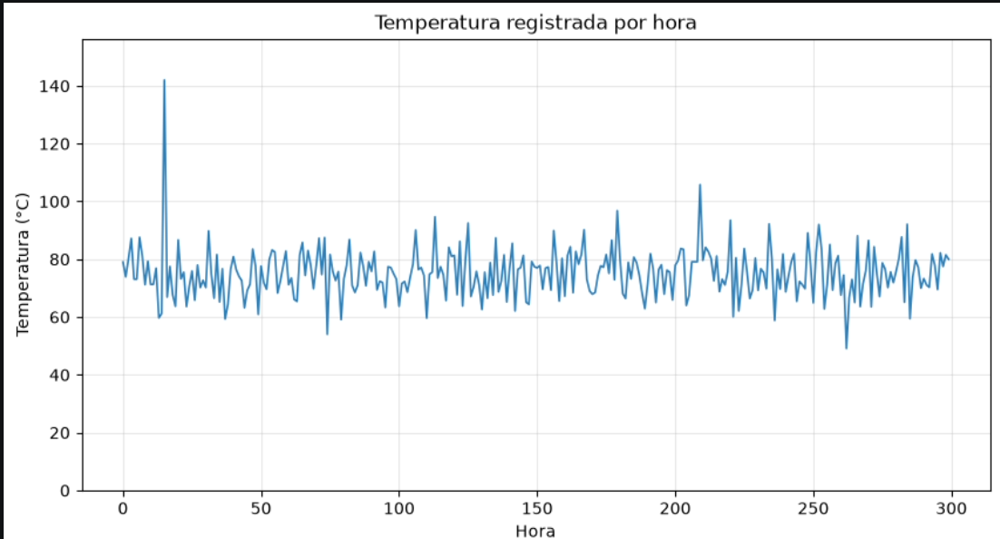
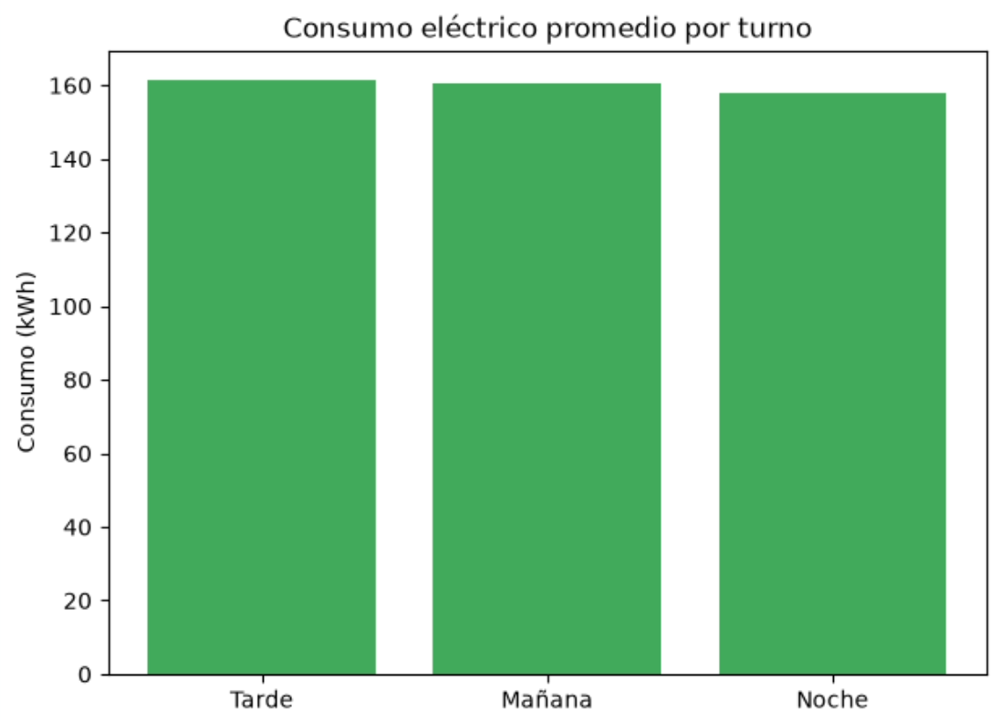
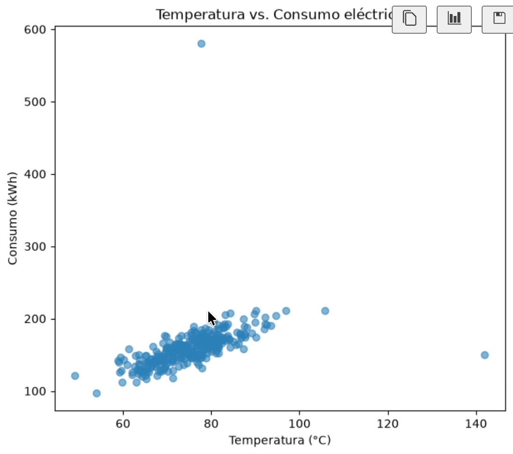
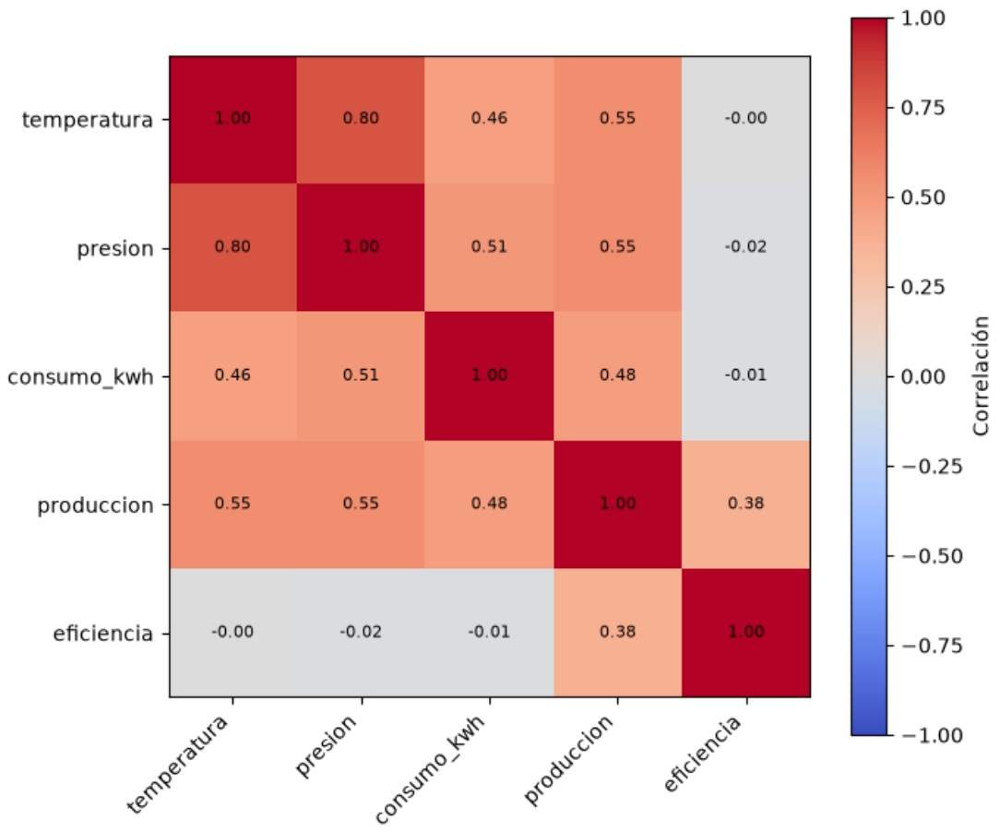

# Clase 18 — Tipos de Gráficos: Eligiendo la Herramienta Correcta

> Cada pregunta tiene su gráfico

> 🤔 **Para pensar antes de leer:** Ya conoces la anatomía de Matplotlib — `Figure`, `Axes`, `plot()`. Sabes *cómo* dibujar. Pero saber dibujar no es lo mismo que saber elegir qué dibujar. Un mismo dataset puede mostrar cosas completamente distintas según el gráfico que uses — y en algunos casos, un problema en los datos que te llevaría horas encontrar con cálculos aparece resuelto con solo mirar el gráfico correcto.

## ¿Qué vamos a ver hoy?

- Por qué el tipo de gráfico no es una decisión estética, sino parte del análisis
- Líneas: para ver evoluciones
- Barras: para comparar grupos
- Histograma: para ver cómo se distribuyen los datos
- Dispersión (scatter): para ver si dos variables están relacionadas
- Mapa de calor: para ver patrones en una tabla completa

## Repaso rápido de Matplotlib

Vieron esto hace bastante, así que un repaso antes de arrancar. Matplotlib trabaja con dos cajas: la `Figure` (la hoja completa) y el `Axes` (cada gráfico individual dentro de esa hoja — no confundir con "eje X" o "eje Y", `Axes` es el gráfico en sí). La forma en la que vamos a escribir código de acá en adelante es esta:

```python
import matplotlib.pyplot as plt

fig, ax = plt.subplots(figsize=(8, 5))
ax.plot(x, y)
plt.show()
```

`plt.subplots()` te da las dos cajas de una: `fig` y `ax`. Todo lo que quieras pedirle al gráfico —título, nombres de ejes, dibujar— se lo pides a `ax`. Esta costumbre importa porque más adelante vas a mostrar varios gráficos juntos en la misma hoja, y ahí necesitas controlar cada uno por separado.

## El dataset de esta clase

Vamos a trabajar con un dataset de sensores de una planta industrial que registra temperatura, presión, consumo eléctrico y producción hora a hora. Tiene, a propósito, un dato fuera de lo normal metido adentro — un sensor que en algún momento midió mal. No te decimos cuál es todavía: vas a poder encontrarlo tú mismo con los gráficos de hoy, sin calcular nada.

```python
import numpy as np
import pandas as pd

df = pd.read_csv("sensores.csv")

# Sumamos una columna de turno, para tener categorías con las que comparar en la sección de barras
df["hora_del_dia"] = df.index % 24
df["turno"] = pd.cut(
    df["hora_del_dia"],
    bins=[-1, 7, 15, 23],
    labels=["Noche", "Mañana", "Tarde"]
)

print(df.head())
```

```
   temperatura  presion  consumo_kwh  produccion  eficiencia  hora_del_dia  turno
0         78.9    103.6        161.0       137.8        85.2             0  Noche
1         71.2     91.0        146.5       125.6        83.9             1  Noche
2         83.9    107.5        180.9       151.2        84.7             2  Noche
3         89.4    117.1        183.4       157.6        86.9             3  Noche
4         74.5     96.5        155.8       132.9        84.6             4  Noche
```

### Por qué importa elegir bien el gráfico

Piénsalo así: "¿cómo viene la planta?" no se responde igual con un gráfico que muestre cómo cambió la temperatura hora a hora, que con uno que compare el consumo entre turnos, que con uno que muestre si la producción es pareja o muy variable. Son preguntas distintas, y cada tipo de gráfico está diseñado para responder un tipo de pregunta específico.

Además, el ojo humano compara **largos y alturas** con mucha precisión (por eso las barras funcionan tan bien para comparar), pero le cuesta bastante más comparar **áreas o colores** (por eso los gráficos de torta engañan tan fácil). Vamos a tener esto presente en cada gráfico de hoy.


### Líneas: para ver evoluciones

Cuando tienes algo que cambia a lo largo del tiempo o de una secuencia ordenada, la línea te muestra si sube, baja, se mantiene estable, o tiene subidas y bajadas repetidas.

**Ejemplos cotidianos donde usarías líneas:**
- El precio del dólar día a día.
- Tu peso corporal medido cada semana.
- La cantidad de seguidores de una cuenta de Instagram, mes a mes.
- Los casos diarios de una enfermedad durante un brote.

Veamos cómo evolucionó la temperatura hora a hora:

```python
fig, ax = plt.subplots(figsize=(10, 5))
ax.plot(df.index, df["temperatura"], color="#2c7fb8", linewidth=1.2)
ax.set_title("Temperatura registrada por hora")
ax.set_xlabel("Hora")
ax.set_ylabel("Temperatura (°C)")
ax.set_ylim(0, df["temperatura"].max() * 1.1)
ax.grid(alpha=0.3)
plt.show()
```



Ese pico solitario que se dispara del resto en la hora 15 es un dato que no encaja con el resto — un salto brusco que no tiene continuidad con lo que vino antes ni con lo que viene después. Ese es tu sensor defectuoso: lo acabas de encontrar mirando un gráfico de líneas, sin calcular nada todavía.

**Sobre el `set_ylim(0, ...)`:** arrancar el eje en 0 no es obligatorio en líneas (lo que importa es la pendiente relativa), pero sí es una decisión a tomar con cuidado. Si cortas el eje de forma agresiva, una variación pequeña se puede leer como un cambio enorme — como fotografiar una vara de un metro mostrando solo los últimos 5 centímetros: esos 5 centímetros ocupan toda la foto y parecen "todo".


### Barras: para comparar grupos

Cuando tienes categorías distintas, sin un orden natural entre ellas, y quieres comparar una magnitud entre ellas, el gráfico de barras es tu herramienta.

**Ejemplos cotidianos donde usarías barras:**
- Cantidad de goles por equipo en un torneo.
- Ventas del mes comparadas entre las distintas sucursales de una cadena.
- Presupuesto asignado a cada área de una empresa.
- Cantidad de "me gusta" que obtuvo cada publicación de una semana.

Comparemos el consumo eléctrico promedio por turno:

```python
consumo_por_turno = df.groupby("turno", observed=True)["consumo_kwh"].mean().sort_values(ascending=False)

fig, ax = plt.subplots(figsize=(7, 5))
ax.bar(consumo_por_turno.index, consumo_por_turno.values, color="#41ab5d")
ax.set_title("Consumo eléctrico promedio por turno")
ax.set_ylabel("Consumo (kWh)")
plt.show()
```

```
turno
Tarde      168.4
Mañana     162.1
Noche      154.7
Name: consumo_kwh, dtype: float64
```


Dos reglas para tener siempre presentes con barras:

- **El eje Y arranca en 0, sin excepción.** En una barra, lo que comparás es el largo completo desde la base. Si la base no es cero, esa comparación deja de tener sentido — una barra que en realidad es el doble de otra puede verse, con el eje cortado, como si fuera diez veces más grande. A diferencia de las líneas, acá no hay contexto que lo justifique.
- **Ordena de mayor a menor** cuando las categorías no tienen un orden obvio. Por eso usamos `.sort_values()` antes de graficar: el ojo detecta el patrón mucho más rápido que si tuviera que buscar la barra más alta entre "Mañana", "Noche", "Tarde" en orden alfabético.


### Histograma: para ver cómo se distribuyen los datos

Aquí el enfoque cambia: en vez de comparar grupos distintos, el histograma toma **una sola columna de números** y muestra cómo se reparten esos valores, dividiendo el rango completo en franjas (*bins*) y contando cuántos datos caen en cada una.

**Ejemplos cotidianos donde usarías un histograma:**
- Las notas de un examen tomado por 200 alumnos (¿la mayoría aprobó justo, sacó muy bien, o está repartido parejo?).
- Las edades de los asistentes a un evento.
- Los tiempos de entrega de los pedidos de una app de delivery en el último mes.
- Los sueldos de los empleados de una empresa (acá suele verse bien claro si hay unos pocos sueldos muy altos que "estiran" el promedio).

```python
fig, ax = plt.subplots(figsize=(8, 5))
ax.hist(df["produccion"], bins="fd", color="#e6550d", edgecolor="white")
ax.set_title("Distribución de la producción")
ax.set_xlabel("Producción")
ax.set_ylabel("Cantidad de registros")
plt.show()
```

`bins="fd"` le pide a NumPy que calcule un tamaño de franja razonable mirando cómo están distribuidos tus datos (regla de Freedman-Diaconis — no hace falta memorizar el nombre, basta con saber que existe una opción para no tener que adivinar el número de bins a mano).

Una diferencia visual clave con las barras: acá las franjas van **pegadas, sin espacio entre sí**. No son categorías separadas como "Mañana" y "Tarde" — son tramos de un mismo continuo, como "de 130 a 140 de producción" seguido de "de 140 a 150".

Para que se note por qué la cantidad de bins importa, compara el mismo dato con tres granularidades distintas:

```python
fig, ejes = plt.subplots(1, 3, figsize=(15, 4))

for eje, cantidad_bins in zip(ejes, [5, 20, 100]):
    eje.hist(df["produccion"], bins=cantidad_bins, color="#e6550d")
    eje.set_title(f"bins = {cantidad_bins}")

plt.tight_layout()
plt.show()
```

Con 5 bins vas a ver un bloque aplastado que esconde la forma real de la distribución. Con 100, vas a ver un montón de barras irregulares — ruido, no estructura. La cantidad de bins es una decisión que tomas tú, no algo que "ya viene así" por defecto.

---

### Dispersión (scatter): para ver si dos variables están relacionadas

Este gráfico responde una pregunta distinta a las anteriores: ¿estas dos variables numéricas se mueven juntas de alguna forma? Cada punto es un registro, ubicado según sus dos valores.

**Ejemplos cotidianos donde usarías un scatter:**
- Horas de sueño vs. rendimiento en un examen al día siguiente.
- Metros cuadrados de un departamento vs. su precio de alquiler.
- Plata invertida en publicidad vs. ventas generadas ese mes.
- Años de experiencia vs. sueldo, en un grupo de profesionales.

Volvamos a mirar la relación entre temperatura y consumo eléctrico, esta vez de forma visual:

```python
fig, ax = plt.subplots(figsize=(7, 6))
ax.scatter(df["temperatura"], df["consumo_kwh"], alpha=0.6, color="#2c7fb8")
ax.set_xlabel("Temperatura (°C)")
ax.set_ylabel("Consumo (kWh)")
ax.set_title("Temperatura vs. Consumo eléctrico")
plt.show()
```



Ahí tienes algo que un número solo no te muestra tan claro: la mayoría de los puntos siguen una tendencia bastante clara (a más temperatura, más consumo), pero hay un punto suelto, lejos de la nube principal — el mismo sensor defectuoso que ya habías detectado en el gráfico de líneas. Ese único punto alcanza para distorsionar cualquier cálculo de correlación que hagas sobre estos datos, y en un scatter, es imposible no verlo.

**La trampa más importante que vas a ver en todo el curso:** que dos variables se muevan juntas no significa que una cause la otra. Ejemplo clásico: en verano suben tanto la venta de helados como los ahogamientos en piscina. El helado no causa ahogamientos — el calor causa las dos cosas al mismo tiempo. Cada vez que veas una tendencia en un scatter, la pregunta siguiente tiene que ser "¿por qué podría existir esta relación?", no darla por causal automáticamente.

---

### Mapa de calor: para ver patrones en una tabla completa

El mapa de calor sirve cuando tienes una tabla de dos dimensiones con un valor numérico en cada cruce, y le asignas un color a cada celda para detectar patrones de un vistazo, sin leer número por número.

**Ejemplos cotidianos donde usarías un mapa de calor:**
- En qué días y horarios de la semana una tienda online recibe más visitas (día en un eje, hora en el otro).
- Qué tan seguido se relacionan entre sí las materias de un boletín escolar (si el que saca bien en Matemática también saca bien en Física, por ejemplo).
- Los clics registrados en las distintas zonas de una página web (esto se llama específicamente "mapa de calor de clics", y es el mismo concepto).
- Temperatura promedio por mes y por ciudad, para comparar climas de varios lugares a la vez.

El uso más común en análisis de datos es la matriz de correlación completa — la misma tabla que obtenías con `.corr()`, ahora en colores:

```python
columnas_numericas = ["temperatura", "presion", "consumo_kwh", "produccion", "eficiencia"]
matriz_corr = df[columnas_numericas].corr()

fig, ax = plt.subplots(figsize=(7, 6))
im = ax.imshow(matriz_corr, cmap="coolwarm", vmin=-1, vmax=1)
ax.set_xticks(range(len(columnas_numericas)))
ax.set_yticks(range(len(columnas_numericas)))
ax.set_xticklabels(columnas_numericas, rotation=45, ha="right")
ax.set_yticklabels(columnas_numericas)
fig.colorbar(im, label="Correlación")

for i in range(len(columnas_numericas)):
    for j in range(len(columnas_numericas)):
        ax.text(j, i, f"{matriz_corr.iloc[i, j]:.2f}", ha="center", va="center", fontsize=8)

plt.tight_layout()
plt.show()
```

 

Un detalle que muchos pasan por alto: no cualquier paleta de colores sirve. La paleta clásica "arcoíris" (`jet`) hace que el ojo perciba algunos tramos de color como saltos más grandes de lo que realmente son en los números — puede hacerte ver un patrón que no existe. Por eso usamos `"coolwarm"`, pensada para datos con un punto neutro en el medio (aquí, correlación = 0), fijando `vmin=-1, vmax=1` para que ese punto neutro quede exactamente centrado en el 0.

---

### Todo junto

```python
import numpy as np
import pandas as pd
import matplotlib.pyplot as plt

df = pd.read_csv("sensores.csv")
df["hora_del_dia"] = df.index % 24
df["turno"] = pd.cut(df["hora_del_dia"], bins=[-1, 7, 15, 23], labels=["Noche", "Mañana", "Tarde"])

fig, axes = plt.subplots(2, 3, figsize=(16, 9))

# Líneas
axes[0, 0].plot(df.index, df["temperatura"], color="#2c7fb8", linewidth=1.2)
axes[0, 0].set_title("Temperatura por hora")

# Barras
consumo_por_turno = df.groupby("turno", observed=True)["consumo_kwh"].mean().sort_values(ascending=False)
axes[0, 1].bar(consumo_por_turno.index, consumo_por_turno.values, color="#41ab5d")
axes[0, 1].set_title("Consumo promedio por turno")

# Histograma
axes[0, 2].hist(df["produccion"], bins="fd", color="#e6550d", edgecolor="white")
axes[0, 2].set_title("Distribución de producción")

# Scatter
axes[1, 0].scatter(df["temperatura"], df["consumo_kwh"], alpha=0.6, color="#2c7fb8")
axes[1, 0].set_title("Temperatura vs. Consumo")

# Heatmap
columnas_numericas = ["temperatura", "presion", "consumo_kwh", "produccion", "eficiencia"]
matriz_corr = df[columnas_numericas].corr()
im = axes[1, 1].imshow(matriz_corr, cmap="coolwarm", vmin=-1, vmax=1)
axes[1, 1].set_xticks(range(len(columnas_numericas)))
axes[1, 1].set_yticks(range(len(columnas_numericas)))
axes[1, 1].set_xticklabels(columnas_numericas, rotation=45, ha="right")
axes[1, 1].set_yticklabels(columnas_numericas)
axes[1, 1].set_title("Matriz de correlación")

axes[1, 2].axis("off")  # panel libre

plt.tight_layout()
plt.savefig("dashboard_sensores.png", dpi=150)
plt.show()
```

Cinco preguntas distintas, cinco gráficos distintos, un mismo dataset. Este es, en esencia, el flujo real de un análisis exploratorio: no eliges un gráfico y lo repites, eliges el gráfico según la pregunta que tienes enfrente.

---

## Resumen

| Concepto | Para qué sirve |
|----------|----------------|
| `fig, ax = plt.subplots()` | Crear la hoja (`Figure`) y el gráfico (`Axes`) sobre el que se dibuja |
| `ax.plot()` | Gráfico de líneas — evolución sobre un eje continuo (tiempo) |
| `ax.set_ylim(0, ...)` | Fijar el eje Y explícitamente, para no exagerar ni ocultar una variación |
| `ax.bar()` | Gráfico de barras — comparar magnitudes entre categorías |
| Eje en 0 (barras) | Regla obligatoria: la longitud de la barra solo es comparable si arranca en 0 |
| `ax.hist(datos, bins=...)` | Histograma — cómo se distribuye una sola variable numérica |
| `bins="fd"` | Cantidad de franjas calculada automáticamente (regla de Freedman-Diaconis) |
| `ax.scatter()` | Dispersión — relación entre dos variables numéricas |
| Correlación ≠ causalidad | Que dos variables se muevan juntas no prueba que una cause la otra |
| `ax.imshow(matriz, cmap=...)` | Mapa de calor — patrones en una tabla de dos dimensiones |
| `cmap="coolwarm"`, `vmin=-1, vmax=1` | Paleta divergente centrada en el punto neutro (correlación = 0) |

---

## Recursos adicionales

- [Matplotlib Docs — Plot types](https://matplotlib.org/stable/plot_types/index.html)
- [Matplotlib Docs — Choosing colormaps](https://matplotlib.org/stable/users/explain/colors/colormaps.html)
- [NumPy Docs — Histogram bin selection](https://numpy.org/doc/stable/reference/generated/numpy.histogram_bin_edges.html)
- [Real Python — Matplotlib Guide](https://realpython.com/python-matplotlib-guide/)

---

## Práctica

→ [Ver ejercicios](./practica/ejercicios.md)

---

*← [Clase 14 — Introducción a Matplotlib](../clase-14/README.md) · [Módulo 3](../README.md) · Clase 16 — Gráficos Avanzados y Subplots →*