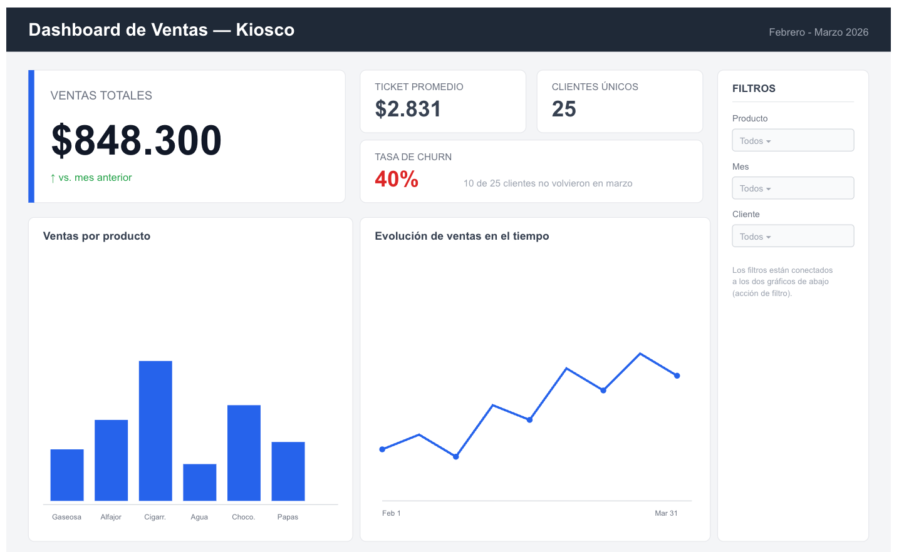

# Ejercicio — Construir un Dashboard de Ventas

El dueño de un kiosco pidió un dashboard para revisar el estado del negocio antes de cada reunión semanal. No tiene tiempo de leer números sueltos ni de interpretar tablas necesita algo que se entienda de un vistazo. El objetivo de este ejercicio no es mostrar todos los datos disponibles: es diseñar algo que comunique lo importante en los primeros segundos.

La imagen muestra un wireframe de referencia con la jerarquía esperada no hay que copiarlo exacto, pero sí replicar el criterio: un indicador dominante, el resto como apoyo, filtros conectados.

## Dataset

`ventas_kiosco.csv` — 300 filas, con estas columnas:

| Columna | Descripción |
|---|---|
| `fecha` | Fecha de la venta |
| `cliente` | Identificador del cliente |
| `producto` | Producto vendido |
| `cantidad` | Unidades vendidas en esa transacción |
| `precio_unitario` | Precio por unidad |

## Consigna

1. **Calcular los indicadores base**: ventas totales, ticket promedio, cantidad de clientes únicos y tasa de churn.

2. **Construir al menos dos visualizaciones adicionales**: una que muestre ventas por producto, y otra que muestre la evolución de las ventas en el tiempo.

3. **Elegir un indicador principal.** De todo lo calculado, decidir cuál es el más importante para este negocio y diseñar el dashboard alrededor de esa decisión —tiene que ser lo primero que se note, usando tamaño, color o posición.

4. **Configurar al menos una acción de filtro**, de forma que interactuar con un visual actualice el resto del dashboard.

5. **Aplicar el test de los 5 segundos.** Mostrarle el dashboard a otra persona durante 5 segundos, taparlo, y preguntarle qué recuerda. Anotar la respuesta tal cual la dio.

6. **Rediseñar según el resultado del test.** Si la persona no pudo nombrar el indicador principal, ajustar la jerarquía visual (tamaño, color, posición, cantidad de elementos) y repetir el test con otra persona.

## Checklist de un dashboard bien hecho

- No más de 5 a 9 elementos visuales en total.
- Hay un elemento que domina claramente sobre los demás (no todo pesa lo mismo).
- Los colores se usan de forma consistente: el mismo color significa lo mismo en todo el dashboard.
- Al menos una acción de filtro funcionando entre visuales.
- Tiene un título que dice de qué se trata, no un nombre genérico.
- Pasó el test de los 5 segundos con al menos una persona.

## Pistas

- Para contar clientes únicos hace falta un conteo distinto (`COUNTD`), no un conteo simple.
- Si la tasa de churn requiere una expresión de nivel de detalle, es válido traerla ya calculada en vez de resolverla dentro de Tableau.
- Conviene construir primero una versión sin ningún criterio de diseño (todo del mismo tamaño y color) y compararla con la versión final — la diferencia ayuda a entender por qué la jerarquía importa.